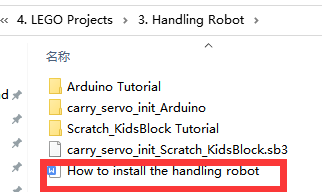

# **A Handling Robot**

## 1.  **Description：**
    
    Among many industrial robots, handling robots are undoubtedly
    effective, applied in industrial manufacturing, warehousing and
    logistics, tobacco, medicine, food, chemical and other industries,
    or in post offices, libraries, ports and parking lots. In this
    experiment, we will use LEGO blocks to build a handling robot to
    carry things.

## 2.  **How to build up a handling robot**
    
    

## 2.  **Test Code：**
    
    
    
    Connect Wifi, click buttons to make the car to
    move toward building blocks and put some building blocks on the
    robot.
    
    Then press to drive the robot to move.
    
    Hold down the button to drive the robot to
    drop building blocks, then building blocks can be conveyed
