# How to use KidsBlock

We demonstrate how to use KidsBlock on Windows system

1.  Interface

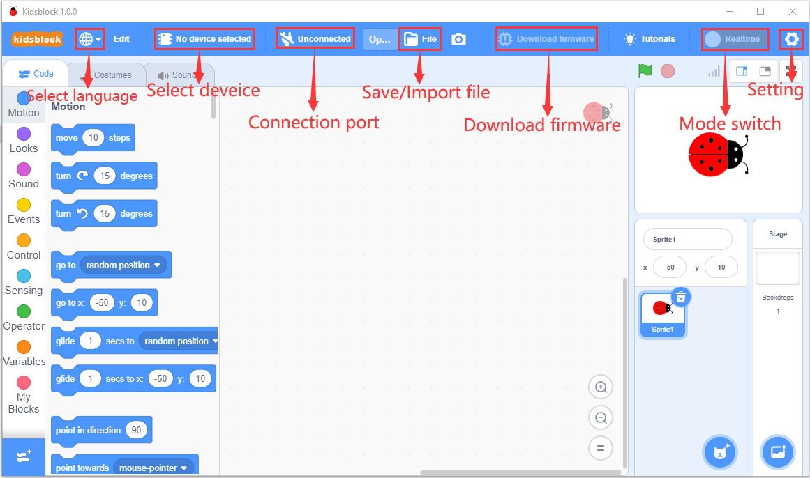

2.  Clickto switch to different languages
    
    
    
    3\. Clickto select“**Install driver**”.
    
    Note: if the driver should be installed, as shown below;

1.  Click “Next” at the **Device Driver Installation Wizard** page.
    
    

<!-- end list -->

2.  > After a while, click“Finish”
    
    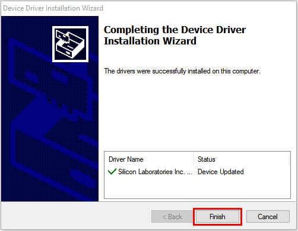

3.  > Then click“Next”.
    
    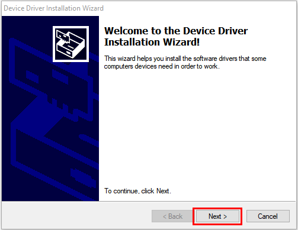

4.  > And click“Finish”.
    
    

5.  > Then click“**Install**”
    
    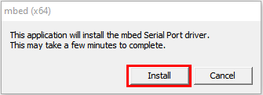

6.  > After a while，click“Finish”
    
    

7.  > Select“Extract”
    
    

8.  > Click“**Next**”
    
    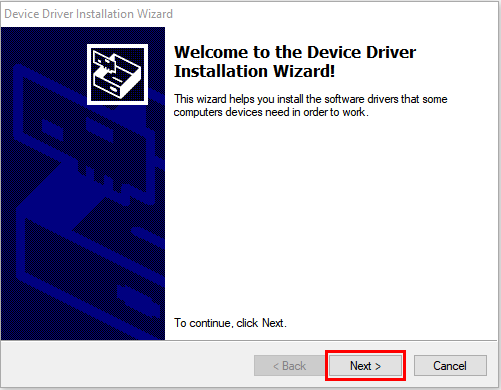

9.  > Next, click“**I accept this agreement**”and“**Next**”。
    
    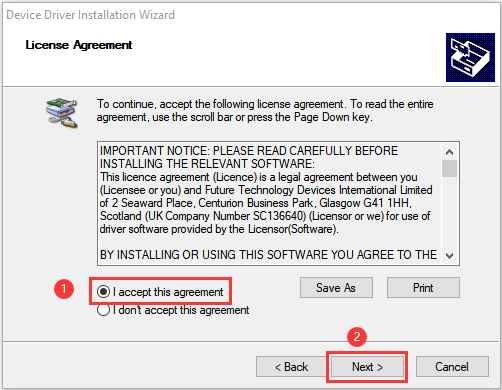

10. > Click“Finish”.
    
    

11. > After a while, click“**INSTALL”**
    
    

<!-- end list -->

15. > After a few seconds, when the driver is installed, just
    > click“**OK**”
    
    
    
    Click  to enter the main page, select the
    control board needed. In this project, we select the Plus board and
    click **Connect.**
    
    Then it is connected,
    
    Click **Go to Editor** to return the code editor.
    
    Icon  will change into
    will change into
    . This means the Plus board is connected to
    the COM port.
    
    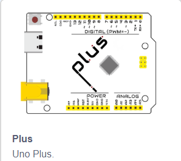
    
    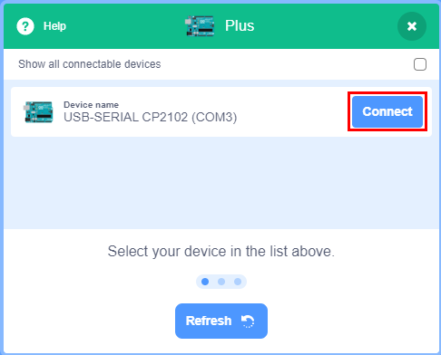
    
    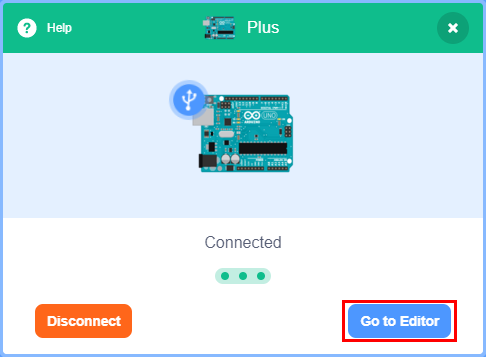
    
    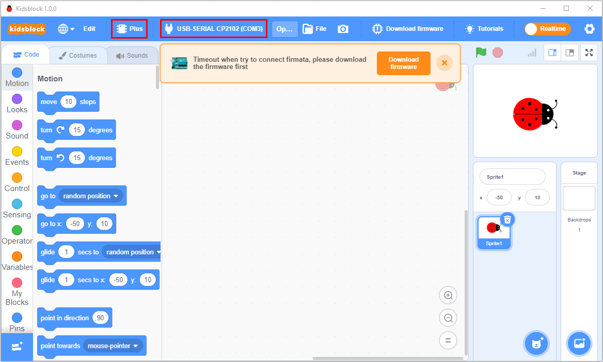

If the ESP8266 board is connected , but icon
. You
need to click to connect the COM port.

Click  and **Connect.**

Then you will find a page pop up, showing **Connected**

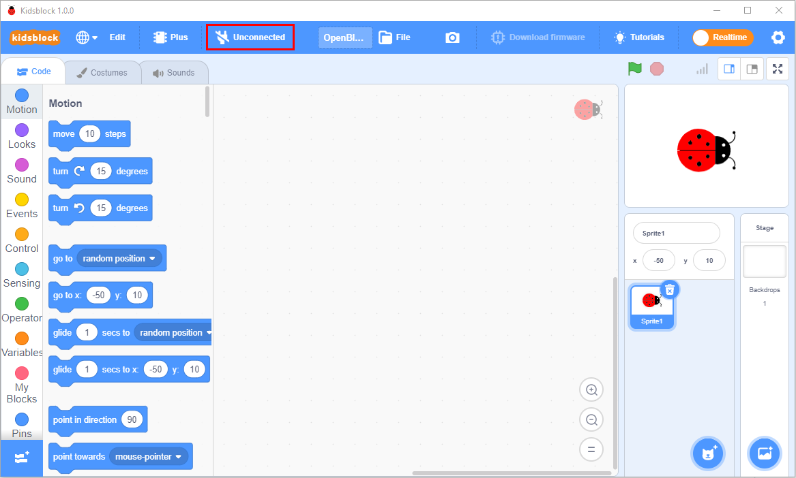

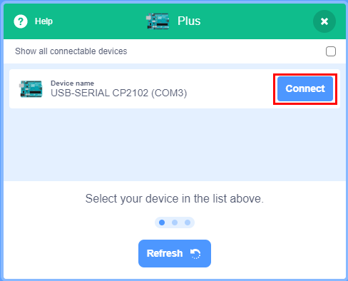

To disconnect the port, just click  and
**Disconnect**

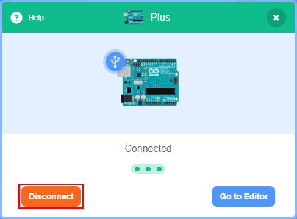

The Plus board and the COM port are connected, then click

will change into 

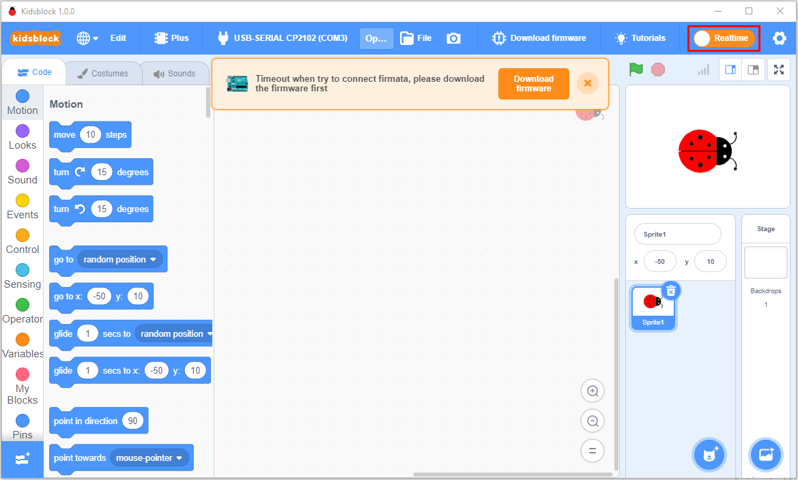

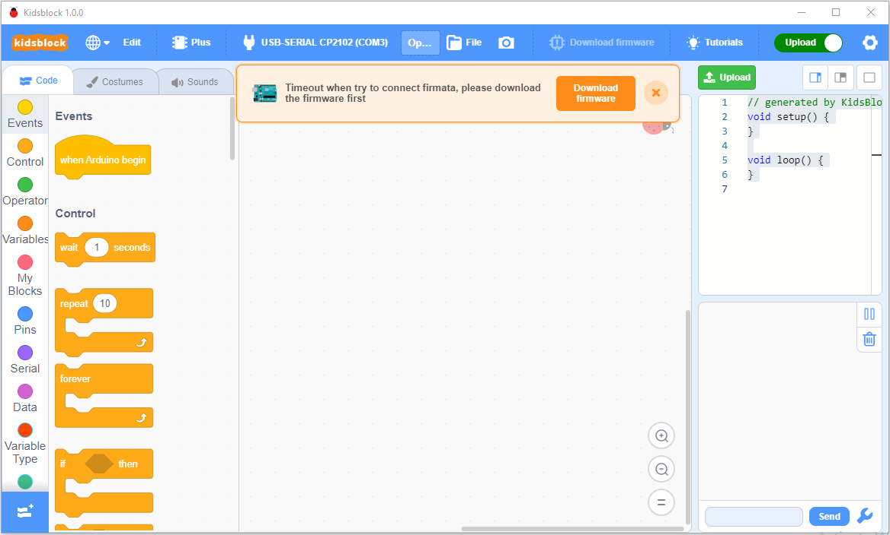

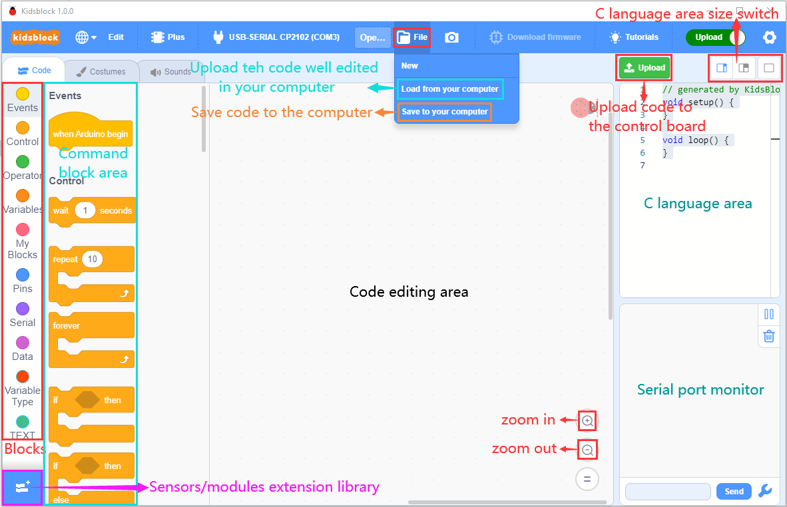

stands for extension libraries of sensors and
modules.

Click  to enter the page of extension libraries,
click a sensor or module to add.

For example, if click the“passive buzzer”,“Not loaded”will change
into“Loaded”. Then the passive buzzer is added

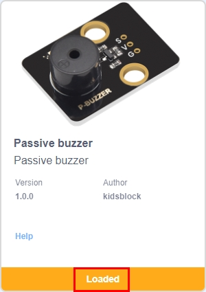

Click  to return the code editor. Then you can
view the passive buzzer in the blocks area.

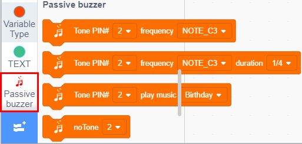

If you want to delete the passive buzzer, click 
to select the passive buzzer. Then“Loaded”will change into“Not loaded”.

Then the passive buzzer is deleted.

。

3.  How to open SB3 type files：

1：Double-click SB3 type files to open them.

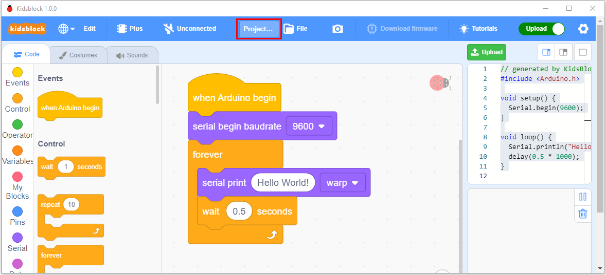

2.  Open Kidsblock，click **file and Load from your computer**，then
    select the SB3 type file on the computer.（for example
    ）

