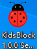
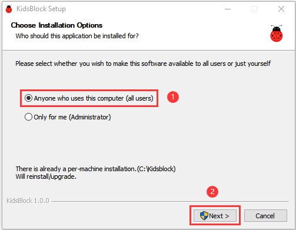
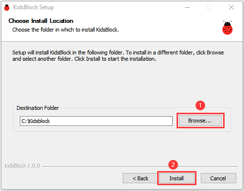
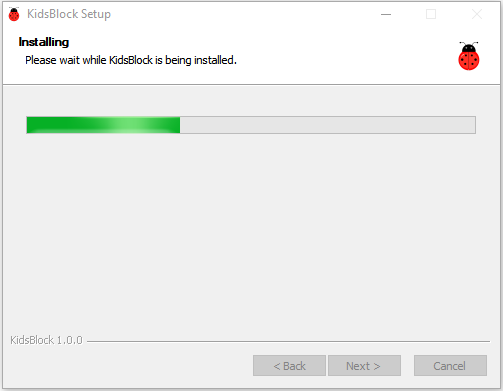
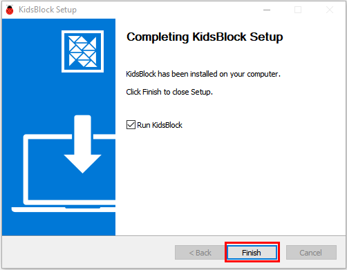
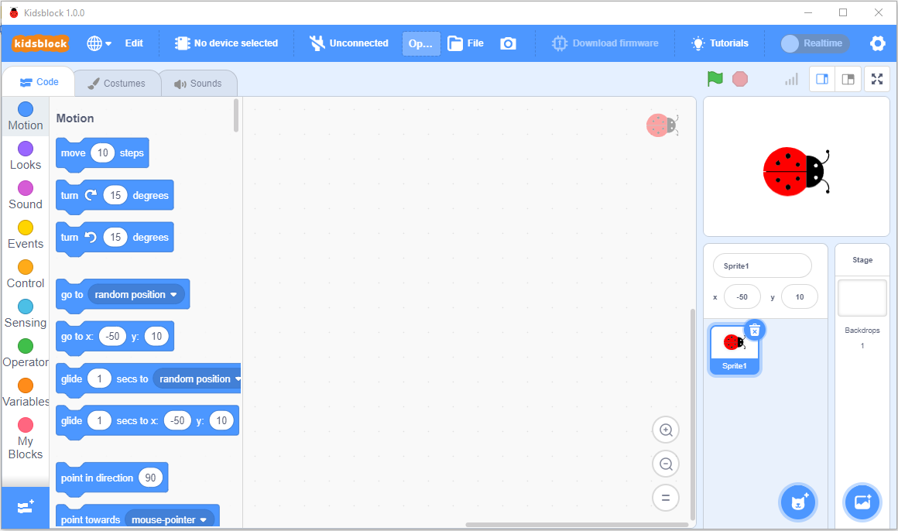

# Install Kidsblock Software---Windows

Note: we take the Windows system as an example. As for MacOS system,
just follow this instruction.

1\. Double click“KidsBlock 1.0.0 Setup.exe”.

2\. Select“**Anyone who uses this computer(all users)**”, then
click“**Next**”.

3\. Click“**Browse...**”and choose the Disk where the software will be
placed (here, we choose C Drive). Then click“**Install**”.

4.  After a few seconds, the installation is complete.
    
    Click "Finish" to open the installed Kidsblock software.
    
    

5.  If the computer security alert window appears, click on“**Allow
    access**”.

This is the main page of the Kidsblock software.

