# **Scratch Tutorials**

## Description：

The Beetlebot smart robot, compatible with LEGO building blocks, is a STEM educational product which can automatically dodge obstacles, follow black lines and light to move. Besides, it has three cool forms such as the soccer robot, the siege robot, the handling robot. As for beginners, they can create whatever
they want by LEGO building blocks.

Various improvements have been made on the Beetlebot car in comparison with other smart cars. It integrates a motor driver and a large number of sensors
and is easy to assemble.

Going forward, not only can it impart basic programming knowledge and AI
application to children and the youth, but also it can cultivate their
creativity, hands-on ability, problem-solving capability, interpersonal
communication as well as teamwork ability. With this kit, you have a
chance to experience soccer games using your own robots.

## Features：

  - Compatible with LEGO building blocks: generate diverse forms with
    LEGO blocks and sensors

  - Three forms: a soccer robot, a siege engine, a handling robot

  - Various functions: Pictures display, atmosphere light control, line
    tracking, obstacle avoidance, light following , IR control and WIFI
    control.

  - Easy to build: embedded design on car body; wire up the car body
    with a few steps

  - High compatibility: reserve ports for the Raspberry Pico board and
    the Arduino Nano board

  - Charging function: integrate a circuit for 18650 batteries, low-cost
    and effective

  - WiFi Control: adopt WiFi control, can finish tailor-made software
    development

  - App: compatible with Android and iOS systems, with aesthetic page
    and flexible control system

## 3\. Specification：

Working voltage: 5V

Input voltage: 2.5V\~4.2V (lithium battery)

Maximum output current: 3A

Maximum power consumption: 15W (T=80℃)

Motor speed: 5V 200 rpm / min

Motor drive form: dual H-bridge

Ultrasonic sensing angle: \<15 degrees

Ultrasonic detection distance: 2cm-400cm

IR control distance: about 7 meters (measured)

Size: 176mm\*137mm\*130mm

Environmental protection attributes: ROHS

## 4\. How to install the Beetlebot car：

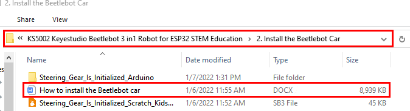

## 5\. PCB Board：

**Turn the DIP switch to the OFF end before installing or removing
batteries**

** Interface Setting：**

After the KidsBlock is installed，open KidsBlock to
click\<“**Beetlebot**”\<“**Connect**”，

Then the **Beetlebot car is connected.** Click**“Go to Editor”**to
return the code editor.

will change
into.

This means the **Beetlebot car is connected to the COM port**

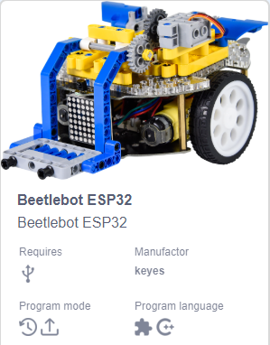

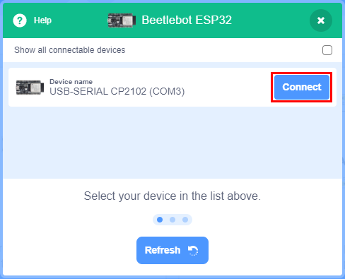

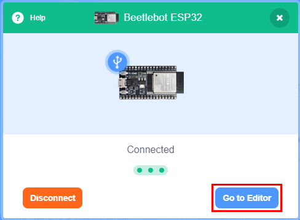

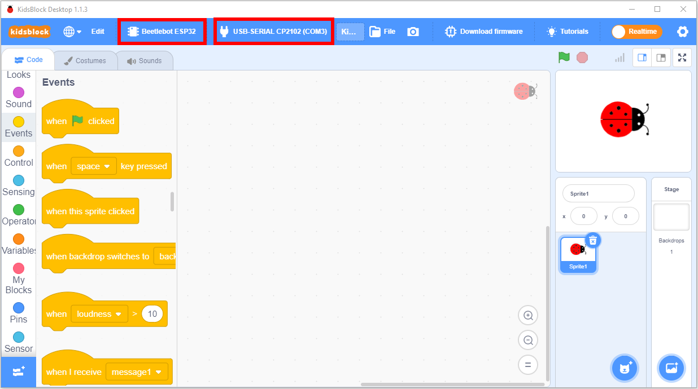

If the car is connected, butdoesn’t change into

，

Just clickto connect the COM
port.Click，then click“**Connect**”，after a while,
if the“**Connected**”page pops up，the com port will be connected.

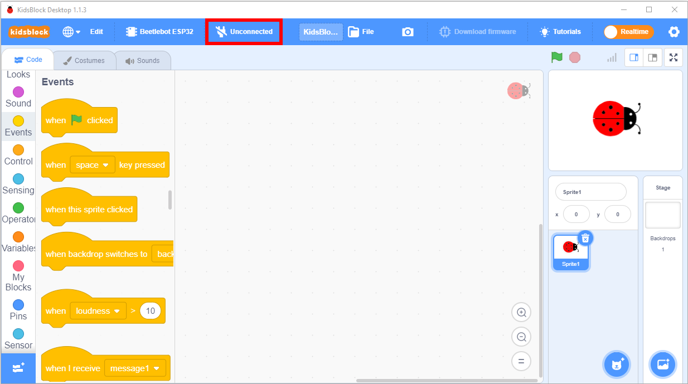

Then click to switch the mode，

The mode

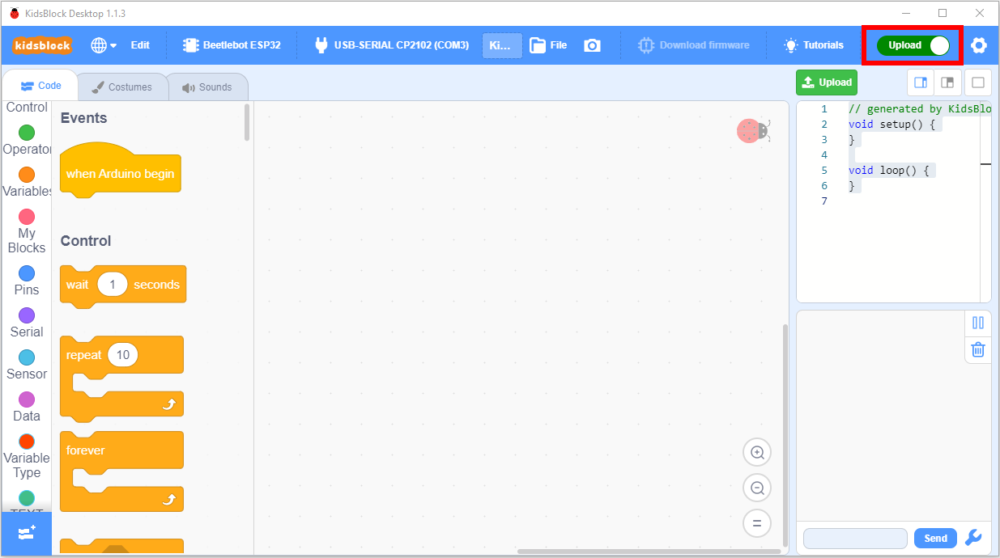

# **Projects：**

## Project 1: 6812 RGB

1.  **Description：**

There are 4 RGB LEDs can be widely used in the decoration of buildings,
bridges, roads, gardens, courtyards and so on by colors adjustment.

In this experiment, we will demonstrate different lighting effects with
them.

2.  **Component Knowledge**

**SK6812RGB:**

From the schematic diagram, we can see that these four pixel lighting
beads are all connected in series. In fact, no matter how many they are,
we can use a pin to control a light and let it display any color. The
pixel point contains a data latch signal shaping amplifier drive
circuit, a high-precision internal oscillator and a 12V high-voltage
programmable constant current control part, which effectively ensures
the color of the pixel point light is highly consistent.

The data protocol adopts a single-wire zero-code communication method.
After the pixel is powered up and reset, the S terminal receives the
data transmitted from the controller. The first 24bit data sent is
extracted by the first pixel and sent to the data latch of the pixel.

3.  **Test Code：**

The SK6812RGB on the PCB board is controlled by the GPIO 14 of the ESP32
board.

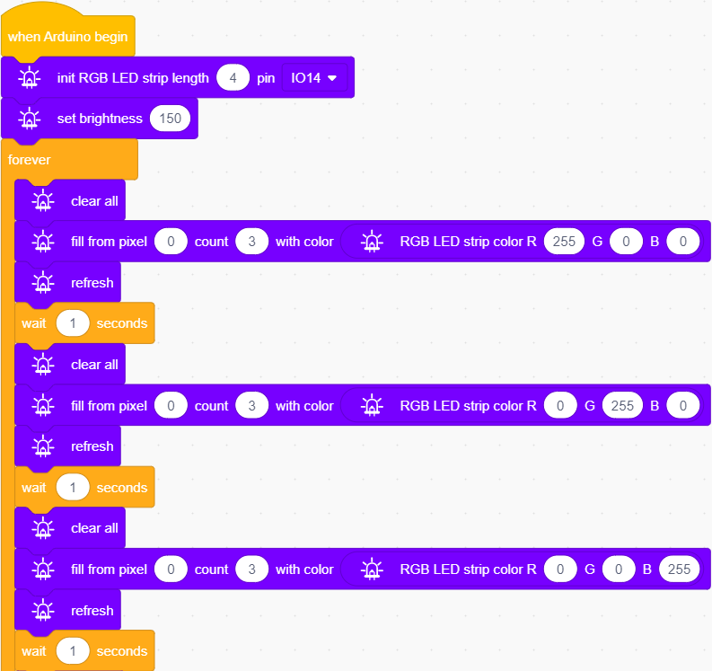

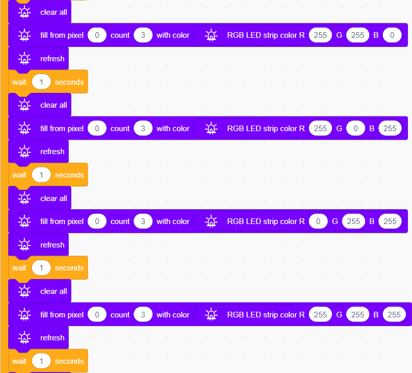

**Test Result**

Upload the code to the ESP32 board(if the code can’t be uploaded, you
can click,
as shown below)

Power up with a USB cable, then 4 RGB LEDs will show different colors

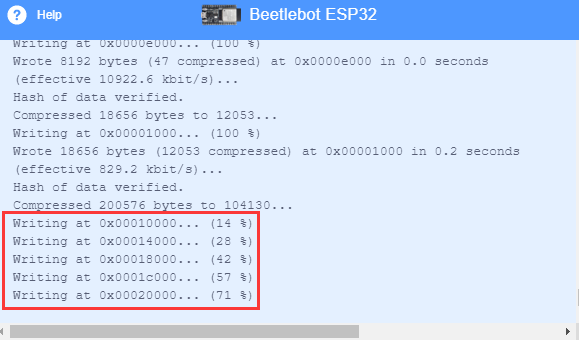

## Project 2: Play Music

1.  **Description：**

There is a power amplifier component on the expansion board, which is
often used to play music and serve as an external amplifying device for
music playback devices.

In this experiment, we use the speaker amplifier component to play
music.

**2. Knowledge：**

Power amplifier modules(equivalent to a passive buzzer) don’t have
internal oscillation circuits.

The power amplifier module can chime sounds with different frequency
when power it up.

**3. Test Code：**

The speaker component on the PCB board is controlled by the GPIO 2 of
the ESP32 board.

**Test Result**

Upload the code to the ESP32 board(if the code can’t be uploaded, you
can click,
as shown below)

Power up with a USB cable, then the speaker module on the PCB board will
play a song.

## Project 3: 8\*8 Dot Matrix

1.  **Description：**
    
    Composed of LED emitting tube diodes, the 8\*8 LED dot matrix are
    applied widely to public information display like advertisement
    screen and bulletin board, by controlling LED to show words,
    pictures and videos, etc.
    
    **2. Knowledge：**

There are different types of matrices, including 4×4, 8×8 and 16×16 and
etc. It contains 64 LEDs.

The inner structure of 8×8 dot matrix is shown below.

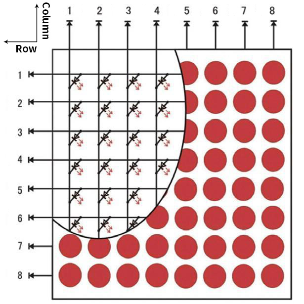

Every LED is installed on the cross point of row line and column line.
When the voltage on a row line increases, and the voltage on the column
line reduces, the LED on the cross point will light up. 8×8 dot matrix
has 16 pins. Put the silk-screened side down and the numbers are 1, 8, 9
and 16 in anticlockwise order as marked below.

The definition inner pins are shown below:

For instance, to light up the LED on row 1 and column 1, you should
increase the voltage of pin 9 and reduce the voltage of pin 13.

**HT16K33 8X8 Dot Matrix**

The HT16K33 is a memory mapping and multi-purpose LED controller driver.
The max. Display segment numbers in the device is 128 patterns (16
segments and 8 commons) with a 13\*3 (MAX.) matrix key scan circuit. The
software configuration features of the HT16K33 makes it suitable for
multiple LED applications including LED modules and display subsystems.
The HT16K33 is compatible with most microcontrollers and communicates
via a two-line bidirectional I2C-bus.

The picture below is the working schematic of HT16K33 chip

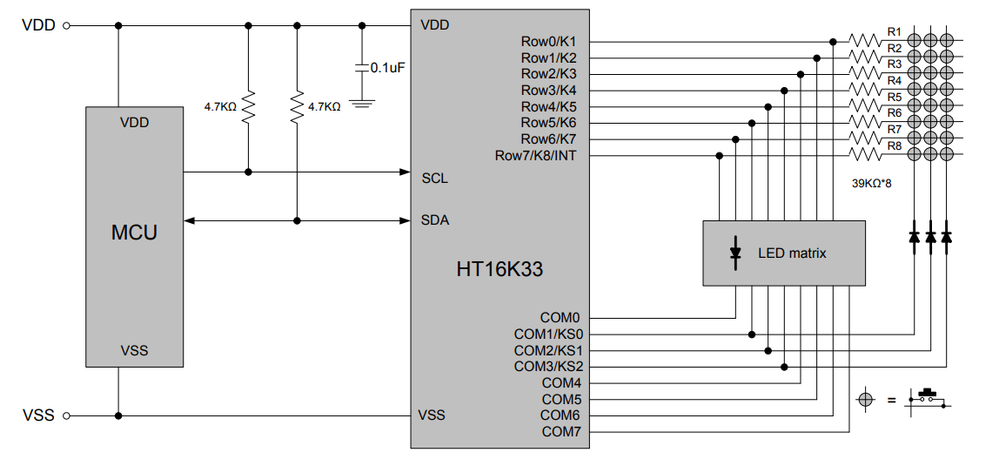

We design the drive module of 8\*8 dot matrix based on the above
principle. We could control the dot matrix by I2C communication and two
pins of microcontroller, according to the above diagram.

**Specification:**

  - Input voltage: 5V    

  - Rated input frequency: 400KHZ 

  - Input power: 2.5W  

  - Input current: 500mA  
    
    4\. Introduction for Modulus Tool

The online version of dot matrix modulus tool:

[http://dotmatrixtool.com/\#](http://dotmatrixtool.com/)

①Open the link to enter the following page.

②The dot matrix is 8\*8 in this project. So set the height to 8, width
to 8; as shown below.

③Click **Endian** to select **Big Endian**(MSB)

③ Generate hexadecimal data from the pattern

As shown below, the left button of the mouse is for selection while the
right is for canceling. Thus you could use them to draw the pattern you
want, then click **Generate**, to yield the hexadecimal data needed.

**Wiring up：**

<table>
<tbody>
<tr class="odd">
<td>8*8 Dot matrix display</td>
<td>PCB Board</td>
</tr>
<tr class="even">
<td>G</td>
<td>G</td>
</tr>
<tr class="odd">
<td>5V</td>
<td>5V</td>
</tr>
<tr class="even">
<td>SDA</td>
<td>SDA</td>
</tr>
<tr class="odd">
<td>SCL</td>
<td>SCL</td>
</tr>
</tbody>
</table>

**3. Test Code：**

The 8\*8 dot matrix is controlled by GPIO21（SDA）and GPIO22（SCL）of the
ESP32 board.

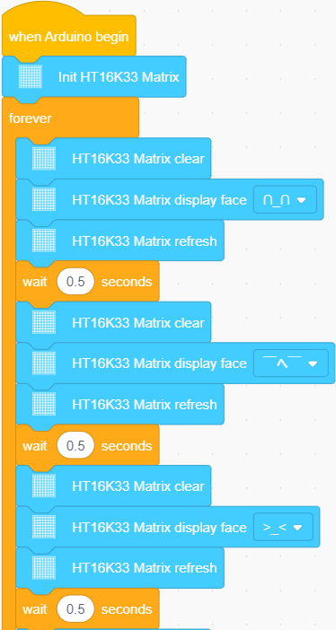

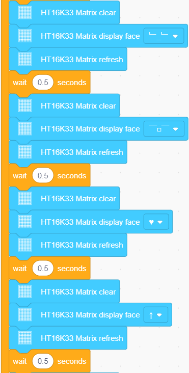

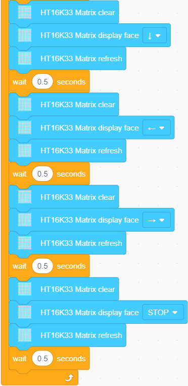

**Test Result**

Upload the code to the ESP32 board(if the code can’t be uploaded, you
can click,
as shown below)

Power up by a USB cable, the 8\*8 dot matrix display will show show
patterns.

## Project 4: Servo Rotation

1.  **Description：**

There are two servos on the car. We take the servo connected to pin D9
as an example.

The servo is a motor that can rotate very accurately. It has been widely
applied to toy cars, remote control helicopters, airplanes, robots and
other fields. In this project, we will use the Nano motherboard to
control the servo to spin.

2.  **Knowledge：**

Servo motor is a position control rotary actuator. It mainly consists of
a housing, a circuit board, a core-less motor, a gear and a position
sensor. Its working principle is that the servo receives the signal sent
by MCU or receiver and produces a reference signal with a period of 20ms
and width of 1.5ms, then compares the acquired DC bias voltage to the
voltage of the potentiometer and obtain the voltage difference output.

When the motor speed is constant, the potentiometer is driven to rotate
through the cascade reduction gear, which leads that the voltage
difference is 0, and the motor stops rotating. Generally, the angle
range of servo rotation is 0° --180 °

The rotation angle of servo motor is controlled by regulating the duty
cycle of PWM (Pulse-Width Modulation) signal. The standard cycle of PWM
signal is 20ms (50Hz). Theoretically, the width is distributed
between 1ms-2ms, but in fact, it's between 0.5ms-2.5ms. The width
corresponds the rotation angle from 0° to 180°. But note that for
different brand motors, the same signal may have different rotation
angles. 

In general, servo has three lines in brown, red and orange. The brown
wire is grounded, the red one is a positive pole line and the orange one
is a signal line.

3.  **Wire up：**

<table>
<tbody>
<tr class="odd">
<td>Servo</td>
<td>PCB Board</td>
</tr>
<tr class="even">
<td>Brown</td>
<td>G</td>
</tr>
<tr class="odd">
<td>Red</td>
<td>5V</td>
</tr>
<tr class="even">
<td>Orange</td>
<td>S1（GPIO4）</td>
</tr>
</tbody>
</table>

4.  **Test Code：**

The servo for controlling the ultrasonic sensor is controlled by the
GPIO4 of the ESP32 board.

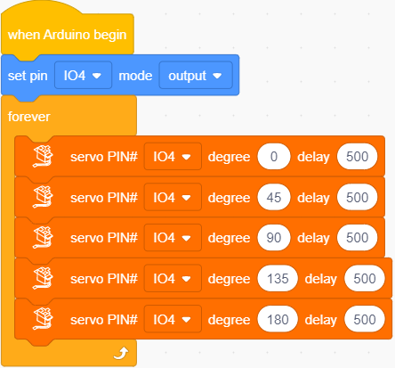

**Test Result：**

Upload the code to the ESP32 board(if the code can’t be uploaded, you
can click,
as shown below)

Power up with a USB cable, open the monitor and set baud rate to 115200.
Then the arm of the servo will rotate to 0°, 45°, 90°, 135° and 180°

## Project 5: Motor Driving and Speed Control 

1.  **Description：**

There are many ways to drive motors. This car uses the most commonly
used DRV8833 motor driver chip, which provides a dual-channel bridge
electric driver for toys, printers and other motor integration
applications.

In this experiment, we use the DRV8833 motor driver chip on the
expansion board to drive the two DC motors, and demonstrate the effect
of forward, backward, left-turning, and right-turning.

2.  **Knowledge：**

DRV8833 motor driver chip: Dual H-bridge motor driver with current
control function, can drive two DC motors, one bipolar stepper motor,
solenoid valve or other inductive loads. Each H-bridge includes
circuitry to regulate or limit winding current.

An internal shutdown function with a fault output pin is used for
over-current and short circuit protection, under-voltage lockout and
over-temperature. A low-power sleep mode is also added. Let's take a
look at the schematic diagram of the DRV8833 motor driver chip driving
two DC motors:

If you want to get insight to it, you can check the specification of
this chip. Just browse it in the“Attachments”folder.

**3. Specification：**

Input voltage of logic part: DC 5V

Input voltage of driving part : DC 5V

Working current of logic part: \<30mA

Operating current of driving part: \<2A

Maximum power dissipation: 10W (T=80℃)

Motor speed: 5V 200 rpm / min

Motor drive form: dual H-bridge drive

Control signal input level: high level 2.3V\<Vin\<5V, low level
-0.3V\<Vin\<1.5V

Working temperature: -25\~130℃

**4. Drive the car to move**

From the above diagram, the direction pin of the left motor is GPIO33;
the speed pin is GPIO26; GPIO32 is the direction pin of the right motor;
and GPIO25 is speed pin.

PWM drives the robot car. The PWM value is in the range of 0-255. The
more the PWM value is set, the faster the rotation of the motor.

<table>
<tbody>
<tr class="odd">
<td>Function</td>
<td>GPIO33</td>
<td>GPIO26（PWM)</td>
<td>Left motor</td>
<td>GPIO32</td>
<td>GPIO25（PWM）（PWM）</td>
<td>Right motor</td>
</tr>
<tr class="even">
<td>forward</td>
<td>LOW</td>
<td>200</td>
<td>clockwise</td>
<td>LOW</td>
<td>200</td>
<td>clockwise</td>
</tr>
<tr class="odd">
<td>Go back</td>
<td>HIGH</td>
<td>50</td>
<td>anticlockwise</td>
<td>HIGH</td>
<td>50</td>
<td>anticlockwise</td>
</tr>
<tr class="even">
<td>Turn left</td>
<td>HIGH</td>
<td>200</td>
<td>anticlockwise</td>
<td>LOW</td>
<td>200</td>
<td>clockwise</td>
</tr>
<tr class="odd">
<td>Turn right</td>
<td>LOW</td>
<td>200</td>
<td>clockwise</td>
<td>HIGH</td>
<td>200</td>
<td>anticlockwise</td>
</tr>
<tr class="even">
<td>Stop</td>
<td>LOW</td>
<td>0</td>
<td>stop</td>
<td>LOW</td>
<td>0</td>
<td>stop</td>
</tr>
</tbody>
</table>

3.  **Test Code：**

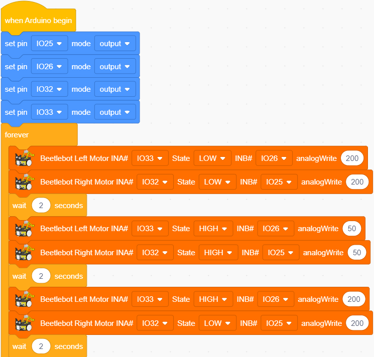

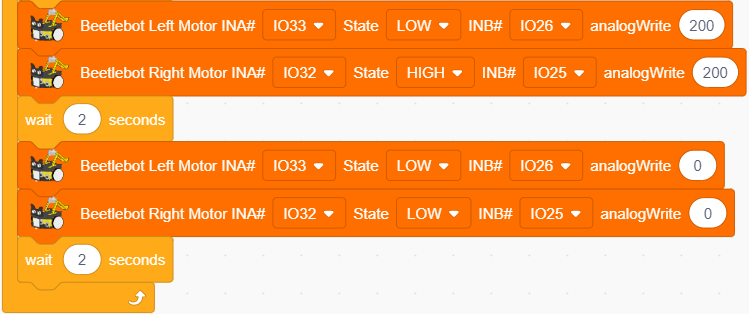

**Test Result**

Upload the code to the ESP32 board(if the code can’t be uploaded, you
can click,
as shown below).

Place batteries in the car, and turn the power switch to ON end and
power up. Then the car moves forward for 2s, backward for 2s, turns left
for 2s and right for 2s, stops for 2s.

## Project 6: Ultrasonic Sensor

There is an ultrasonic sensor on the car. It is a very affordable
distance-measuring sensor.

The ultrasonic sensor sends a high-frequency ultrasonic signal that
human hearing can’t hear. When encountering obstacles, these signals
will be reflected back immediately. After receiving the returned
information, the distance between the sensor and the obstacle will be
calculated by judging the time difference between the transmitted signal
and the received signal. It is mainly used for object avoidance and
ranging in various robotics projects.

### Project 6.1: Ultrasonic Ranging

**1.Description：**

In this experiment, we use an ultrasonic sensor to measure distance and
print the data on a serial monitor.

**2. Knowledge：**

The HC-SR04 ultrasonic sensor uses sonar to determine distance to an
object like what bats do. It offers excellent non-contact range
detection with high accuracy and stable readings in an easy-to-use
package. It comes complete with ultrasonic transmitter and receiver
modules.

The HC-SR04 or the ultrasonic sensor is being used in a wide range of
electronics projects for creating obstacle detection and distance
measuring application as well as various other applications. Here we
have brought the simple method to measure the distance with Arduino and
ultrasonic sensor and how to use ultrasonic sensor with Arduino.

**Use method and timing chart of ultrasonic module:**

1.  Setting the delay time of Trig pin of SR04 to 10μs at least, which
    can trigger it to detect distance.

2.  After triggering, the module will automatically send eight 40KHz
    ultrasonic pulses and detect whether there is a signal return. This
    step will be completed automatically by the module.

3.  If the signal returns, the Echo pin will output a high level, and
    the duration of the high level is the time from the transmission of
    the ultrasonic wave to the return.

Time=Echo pulse width, unit: us

Distance（cm）=time/ 58

Distance(inch)=time/ 148

The HC-SR04 ultrasonic sensor has four pins: Vcc, Trig, Echo and GND.

The Vcc pin provides power generating ultrasonic pulses and is connected
to Vcc/+5V. The GND pin is grounded/GND.

The Trig pin is where the Arduino sends a signal to start the ultrasonic
pulse. The Echo pin is where the ultrasonic sensor sends information
about the duration of the ultrasonic pulse stroke to the Arduino control
board.

**Wiring Up**

<table>
<tbody>
<tr class="odd">
<td>Ultrasonic Sensor</td>
<td>PCB Board</td>
</tr>
<tr class="even">
<td>Vcc</td>
<td>5V</td>
</tr>
<tr class="odd">
<td>Trig</td>
<td>S2（GPIO5）</td>
</tr>
<tr class="even">
<td>Echo</td>
<td>S1（GPIO18）</td>
</tr>
<tr class="odd">
<td>Gnd</td>
<td>G</td>
</tr>
</tbody>
</table>

**3. Test Code：**

The pin Trig and Echo of the ultrasonic sensor are controlled by the
GPIO5 and GPIO18 of the ESP32 board.

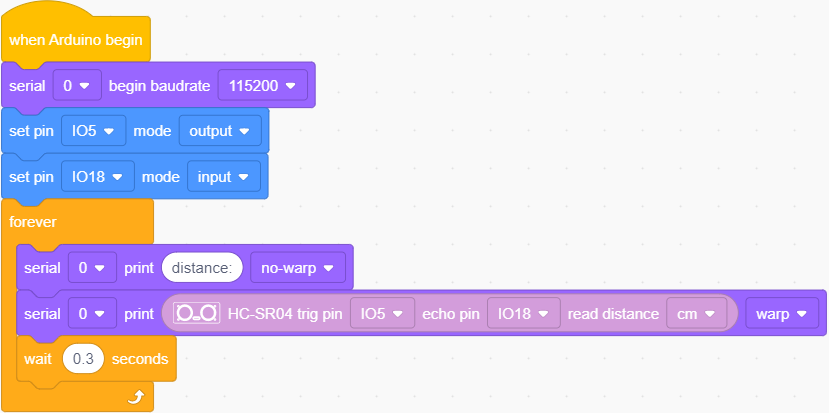

**4. Test Result：**

Upload the test code to the ESP32 board, power up with a USB cable, open
the serial monitor to click  and set baud rate to
115200.

When you move an object in front of the ultrasonic sensor, it will
detect the distance and the serial monitor will show the distance value.

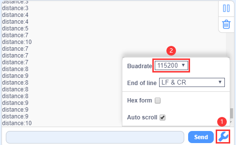

### Project 6.2: Light Following

**1.Description：**

In the above experiments, we have learned about the 8\*8 dot matrix,
motor drivers and speed regulation, ultrasonic sensors, servos and other
hardware. In this experiment, we will combine them to create a follow
car with the ultrasonic sensor. The can can follow an object to move
through

measuring distance.

3.  **Working Principle：**

<table>
<tbody>
<tr class="odd">
<td>Detection</td>
<td>Detect the front distance</td>
<td>Distance（unit：cm）</td>
</tr>
<tr class="even">
<td>Condition 1</td>
<td>Distance＜8</td>
<td></td>
</tr>
<tr class="odd">
<td>State</td>
<td>Go back（set PWM to 100）</td>
<td></td>
</tr>
<tr class="even">
<td>Condition 2</td>
<td>8≤distance&lt;13</td>
<td></td>
</tr>
<tr class="odd">
<td>State</td>
<td>stop</td>
<td></td>
</tr>
<tr class="even">
<td>Condition 3</td>
<td>13≤distance&lt;35</td>
<td></td>
</tr>
<tr class="odd">
<td>State</td>
<td>Go forward（set PWM to 100）</td>
<td></td>
</tr>
<tr class="even">
<td>Condition 4</td>
<td>distance≥35</td>
<td></td>
</tr>
<tr class="odd">
<td>State</td>
<td>stop</td>
<td></td>
</tr>
</tbody>
</table>

4.  **Flow Chart：**

**Test Code**

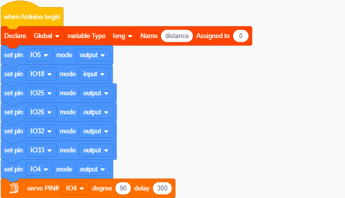

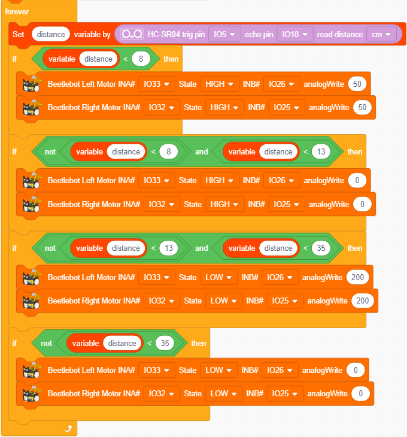

**Test Result**

Upload the code to the ESP32 board(if the code can’t be uploaded, you
can click,
as shown below).

Place batteries in the car and turn the power switch to ON end and power
up. Then the car will follow the obstacle to move.

### Project 6.3: Dodge obstacles

**1.Description：**

In this project, we will take advantage of the ultrasonic sensor to
detect the distance away from the obstacle so as to avoid them

**2. Working Principle：**

<table>
<tbody>
<tr class="odd">
<td></td>
<td>8*8 Dot matrix display</td>
<td></td>
<td></td>
</tr>
<tr class="even">
<td></td>
<td>Set servo to 90°</td>
<td></td>
<td></td>
</tr>
<tr class="odd">
<td><strong>loop</strong></td>
<td>Detect the distance away from the obstacle（unit: cm）</td>
<td></td>
<td></td>
</tr>
<tr class="even">
<td></td>
<td>Condition 1</td>
<td>State</td>
<td></td>
</tr>
<tr class="odd">
<td></td>
<td><strong>0&lt;distance＜10</strong></td>
<td>Stop</td>
<td></td>
</tr>
<tr class="even">
<td></td>
<td></td>
<td>Show the“stop”pattern</td>
<td></td>
</tr>
<tr class="odd">
<td></td>
<td></td>
<td>Set the servo to 180°</td>
<td>Distance away form the obstacle：a1（unit：cm）</td>
</tr>
<tr class="even">
<td></td>
<td></td>
<td>Set the servo to 0°</td>
<td>Distance away form the obstacle：a2（unit：cm）</td>
</tr>
<tr class="odd">
<td></td>
<td></td>
<td>Condition 2</td>
<td>State</td>
</tr>
<tr class="even">
<td></td>
<td></td>
<td><strong>a1＜a2</strong></td>
<td>Car turns right（set PWM to 200）</td>
</tr>
<tr class="odd">
<td></td>
<td></td>
<td></td>
<td>show“turning right”pattern</td>
</tr>
<tr class="even">
<td></td>
<td></td>
<td></td>
<td>Set servo to 90°</td>
</tr>
<tr class="odd">
<td></td>
<td></td>
<td><strong>a1≥a2</strong></td>
<td>Turn left（set PWM to 200）</td>
</tr>
<tr class="even">
<td></td>
<td></td>
<td></td>
<td>display“left turning”pattern</td>
</tr>
<tr class="odd">
<td></td>
<td></td>
<td></td>
<td>Set servo to 90°</td>
</tr>
<tr class="even">
<td></td>
<td><strong>distance≥10</strong></td>
<td>The 8*8 dot matrix display shows“going forward”pattern</td>
<td></td>
</tr>
<tr class="odd">
<td></td>
<td></td>
<td>Go forward（set PWM to 200）</td>
<td></td>
</tr>
</tbody>
</table>

**3. Flow Chart：**

**4. Test Code**

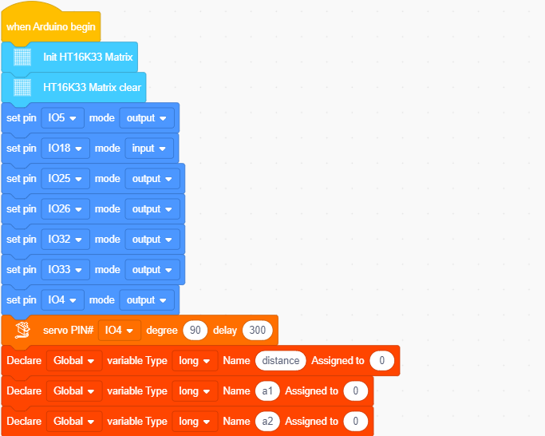

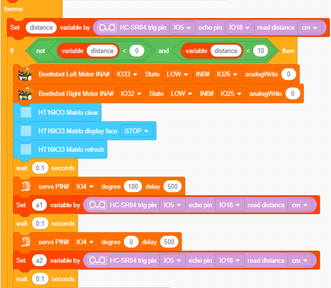

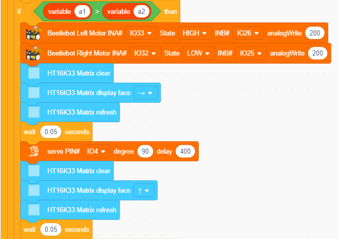

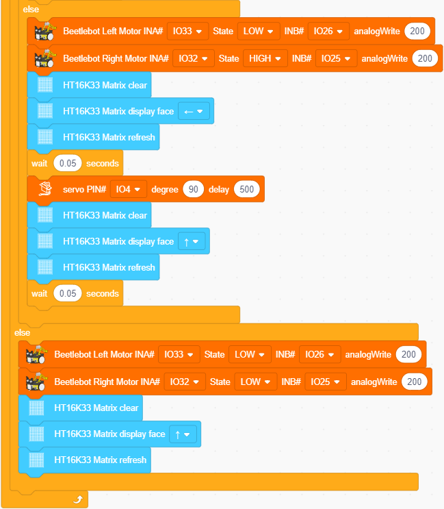

**Test Result：**

Upload the test code to the ESP32 board, put batteries in the battery
holder, turn the power switch to the ON end and power up. Then the car
can automatically dodge obstacles

## Project 7: Line Tracking Sensor

There are two IR line tracking sensors on the car. They are actually two
pairs of ST188L3 infrared tubes and used to detect black and white
lines. In this project, we will make a line tracking car

### **Project 7.1: Reading Values**

**1.Description：**

In this experiment, we use ST188L3 infrared tubes to detect black and
white lines, then print the data on the serial monitor.

**2. Knowledge：**

**Infrared line tracking:**

The IR line tracking sensor boasts a pair of ST188L3 infrared tubes.
ST188L3 tubes has an infrared emitting diode and a receiver tube. When
the emitting diode emits an infrared signal then received by the
receiving tube after being reflected by the white object. Once the
receiving tube receives the signal, the output terminal will output a
low level (0); when the infrared emitting diode emits an infrared
signal, and the infrared signal is absorbed by the black object, a high
level (1) will be output, thus realizing the function of detecting
signals through infrared rays.

Warning: Reflective optical sensors (including IR line tracking sensors)
shouldn’t be applied under sunlight as there is a lot of invisible light
such as infrared and ultraviolet.

Values detected by the line tracking sensor are shown in the table.

The value will be 1 if detecting black or no objects and the value 0
will appear if detecting white objects.

he detected black object or no object represents 1, and the detected
white object represents 0.

<table>
<tbody>
<tr class="odd">
<td>Left</td>
<td>Right</td>
<td>Value（Binary ）</td>
</tr>
<tr class="even">
<td>0</td>
<td>0</td>
<td>00</td>
</tr>
<tr class="odd">
<td>0</td>
<td>1</td>
<td>01</td>
</tr>
<tr class="even">
<td>1</td>
<td>0</td>
<td>10</td>
</tr>
<tr class="odd">
<td>1</td>
<td>1</td>
<td>11</td>
</tr>
</tbody>
</table>

**3. Test Code：**

The line tracking sensors of the PCB board are controlled by GPIO17 and
GPIO16 of the ESP32 baord.

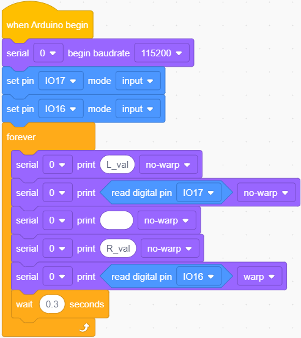

**4. Test Result：**

Upload the test code to the ESP32 board, power up with a USB cable, open
the serial monitor to click  and set baud rate to
115200.

Put a black thing under the line tracking sensor of the car and move it,
you will see different indicators light up, and at the same time you
will see the value on the serial monitor.

The sensitivity can be adjusted by rotating the potentiometer. When the
indicator light is adjusted to the critical point of on and off state,
the sensitivity is the highest.

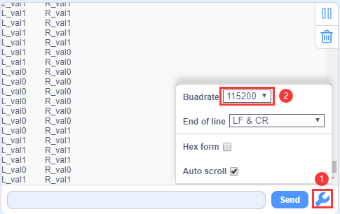

### Project 7.2: Line Tracking

**1.Description：**

We’ve introduced the knowledge of motor drivers, speed regulation, and
infrared line tracking. In this experiment, the car will perform
different actions according to the values transmitted by the infrared
tracking.

2.  **Working Principle：**

<table>
<tbody>
<tr class="odd">
<td>Left</td>
<td>Right</td>
<td>Value（Binary ）</td>
<td>State</td>
</tr>
<tr class="even">
<td>0</td>
<td>0</td>
<td>00</td>
<td>Stop</td>
</tr>
<tr class="odd">
<td>0</td>
<td>1</td>
<td>01</td>
<td>Turn right</td>
</tr>
<tr class="even">
<td>1</td>
<td>0</td>
<td>10</td>
<td>Turn left</td>
</tr>
<tr class="odd">
<td>1</td>
<td>1</td>
<td>11</td>
<td>Move forward</td>
</tr>
</tbody>
</table>

3.  **Flow Chart：**

4.  **Test Code：**

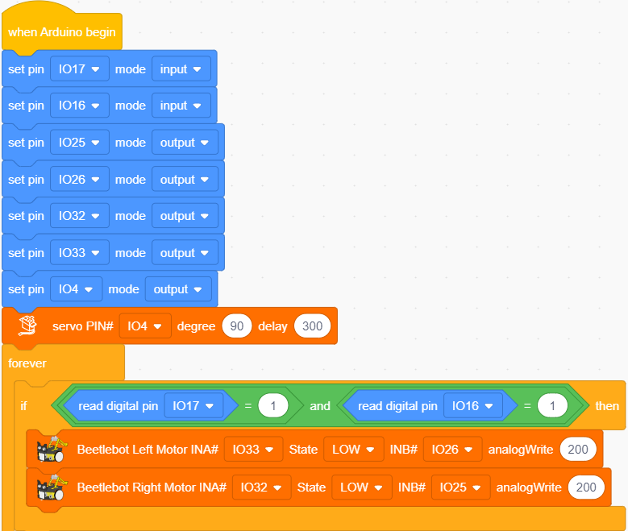

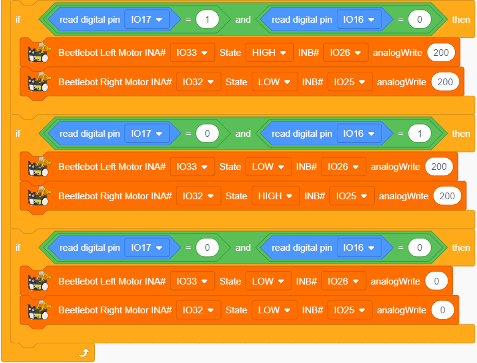

5.  **Test Result：**

Upload the test code to the ESP32 board, put batteries in the battery
holder, turn the power switch to the ON end, power up and put the car on
a map we provide. Then it will perform different functions via values
sent by line tracking sensors

## Project 8: Light Following

There are two photoresistors on the car. They can vary with the light
intensity and send information to the Nano board to control the car.

Photoresistors can determine and conduct the car to move by detecting
light

### Project 8.1: Read Values

1.  **Description：**

In this experiment, we will learn the working principle of the
photoresistor

**2. Knowledge：**

**Photoresistor:**

It mainly uses a photosensitive resistance element whose resistance
varies from the light intensity. The signal terminal of the sensor is
connected to the analog port of the microcontroller. When the light is
stronger, the analog value at the analog port will increase; on the
contrary, when the light intensity is weaker, the analog value of the
microcontroller will reduce. In this way, the corresponding analog value
can reflect the ambient light intensity.

**3. Wire up：**

Through the wiring-up diagram, signal pins of two photoresistors are
connected to A6 and A7 of the Nano board.

For the following experiment, we use the photoresistor connected to A6
to finish experiments. First, let’s read analog values.

<table>
<tbody>
<tr class="odd">
<td>Left photoresistor</td>
<td>PCB board</td>
</tr>
<tr class="even">
<td>G</td>
<td>G</td>
</tr>
<tr class="odd">
<td>V</td>
<td>V</td>
</tr>
<tr class="even">
<td>S</td>
<td>S（GPIO34）</td>
</tr>
</tbody>
</table>

**4. Test Code：**

The left photoresistor is controlled by the GPIO34 of the ESP32 board.

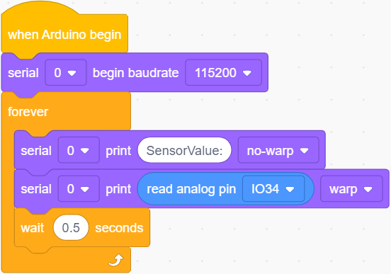

**5. Test Result：**

Upload the test code to the ESP32 board, power up with a USB cable, open
the serial monitor to click  and set baud to
115200.

When the light intensifies, the analog value will get increased; on the
contrary, the analog value will get reduced.

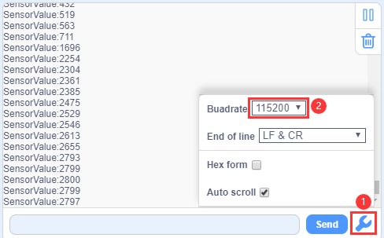

### Project 8.2: Light Following Car

1.  **Description：**

We have learned the working principle of photoresistor, motor and speed
regulation. In this experiment, we will use a photoresistor to detect
the intensity of light as as to achieve the light following effect.

2.  **Working Principle：**

<table>
<tbody>
<tr class="odd">
<td>Analog value of the left sensor</td>
<td>Analog value of the right sensor</td>
<td>Function</td>
</tr>
<tr class="even">
<td>&gt;3000</td>
<td>&gt;3000</td>
<td>Move forward</td>
</tr>
<tr class="odd">
<td>&gt;3000</td>
<td>≤3000</td>
<td>Move to left</td>
</tr>
<tr class="even">
<td>≤3000</td>
<td>&gt;3000</td>
<td>Move to right</td>
</tr>
<tr class="odd">
<td>&lt;3000</td>
<td>&lt;3000</td>
<td>Stop</td>
</tr>
</tbody>
</table>

3.  **Wiring up：**

<table>
<tbody>
<tr class="odd">
<td>Left Photoresistor</td>
<td>
PCB

Board
</td>
<td></td>
<td>Right photoresistor</td>
<td>
PCB

Board
</td>
</tr>
<tr class="even">
<td>G</td>
<td>G</td>
<td></td>
<td>G</td>
<td>G</td>
</tr>
<tr class="odd">
<td>V</td>
<td>V</td>
<td></td>
<td>V</td>
<td>V</td>
</tr>
<tr class="even">
<td>S</td>
<td>S（GPIO34）</td>
<td></td>
<td>S</td>
<td>S（GPIO35）</td>
</tr>
</tbody>
</table>

4.  **Flow Chart：**

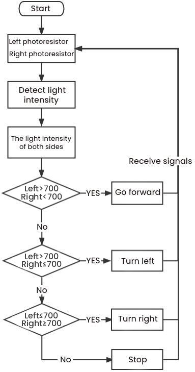

5.  **Test Code：**

The left and right photoresistors are controlled by GPIO34 and GPIO35 of
the ESP32 board.

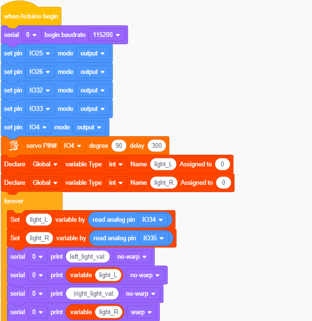

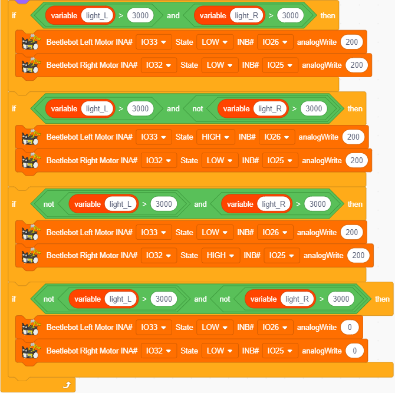

**6. Test Result：**

Upload the test code to the ESP32 board, put batteries in the battery
holder, turn the power switch to the ON end and power up. Then the car
will follow the light to move.

## Project 9: IR Remote Control

Infrared remote controls are everywhere in daily life. It is used to
control various home appliances, such as TV, speakers, video recorders
and satellite signal receivers.

The remote control is composed of an IR emitter, an IR receiver and a
decoding MCU. In this project, we will make a IR remote control car.

### Project 9.1: IR Remote and Reception

**1.Description：**

In this experiment, we will combine the IR receiver and the IR remote
control to read key values and show them on the serial monitor.

2.  **Knowledge：**

**IR Remote Control：**

It is a device with buttons. When the key is pressed, IR signals will be
sent.

Infrared remote control technology is widely used, such as TVs, air
conditioners and so on. And it can control air conditioners and TVs

The infrared remote control adopts NEC coding, and the signal period is
110ms.

The remote control is shown below:

Infrared (IR) receiver:

It can receive infrared light and be used to detect the infrared signal
emitted by the infrared remote control.

It can demodulate the received infrared light signal and convert it back
to binary, and then transmit the information to the microcontroller.

**NEC Infrared communication protocol：**

**NEC Protocol**

To my knowledge the protocol I describe here was developed by NEC (Now
Renesas). I've seen very similar protocol descriptions on the internet,
and there the protocol is called Japanese Format.

I do admit that I don't know exactly who developed it. What I do know is
that it was used in my late VCR produced by Sanyo and was marketed under
the name of Fisher. NEC manufactured the remote control IC.

This description was taken from my VCR's service manual. Those were the
days, when service manuals were filled with useful information\!

**Features**

  - > 8 bit address and 8 bit command length.

  - > Extended mode available, doubling the address size.

  - > Address and command are transmitted twice for reliability.

  - > Pulse distance modulation.

  - > Carrier frequency of 38kHz.

  - > Bit time of 1.125ms or 2.25ms.

**Modulation**

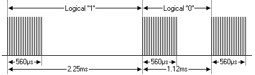

The NEC protocol uses pulse distance encoding of the bits. Each pulse is
a 560µs long 38kHz carrier burst (about 21 cycles). A logical "1" takes
2.25ms to transmit, while a logical "0" is only half of that, being
1.125ms. The recommended carrier duty-cycle is 1/4 or 1/3

**Protocol**

The picture above shows a typical pulse train of the NEC protocol. With
this protocol the LSB is transmitted first. In this case Address $59 and
Command $16 is transmitted. A message is started by a 9ms AGC burst,
which was used to set the gain of the earlier IR receivers. This AGC
burst is then followed by a 4.5ms space, which is then followed by the
Address and Command. Address and Command are transmitted twice. The
second time all bits are inverted and can be used for verification of
the received message. The total transmission time is constant because
every bit is repeated with its inverted length. If you're not interested
in this reliability you can ignore the inverted values, or you can
expand the Address and Command to 16 bits each\!

Keep in mind that one extra 560µs burst has to follow at the end of the
message in order to be able to determine the value of the last bit.

A command is transmitted only once, even when the key on the remote
control remains pressed. Every 110ms a repeat code is transmitted for as
long as the key remains down. This repeat code is simply a 9ms AGC pulse
followed by a 2.25ms space and a 560µs burst.

**Extended NEC protocol**

The NEC protocol is so widely used that soon all possible addresses were
used up. By sacrificing the address redundancy the address range was
extended from 256 possible values to approximately 65000 different
values. This way the address range was extended from 8 bits to 16 bits
without changing any other property of the protocol.

By extending the address range this way the total message time is no
longer constant. It now depends on the total number of 1's and 0's in
the message. If you want to keep the total message time constant you'll
have to make sure the number 1's in the address field is 8 (it
automatically means that the number of 0's is also 8). This will reduce
the maximum number of different addresses to just about 13000.

The command redundancy is still preserved. Therefore each address can
still handle 256 different commands.

Keep in mind that 256 address values of the extended protocol are
invalid because they are in fact normal NEC protocol addresses. Whenever
the low byte is the exact inverse of the high byte it is not a valid
extended address.

**3.Test Code：**

The IR receiver on the PCB board is controlled by GPIO19 of the ESP32
board.

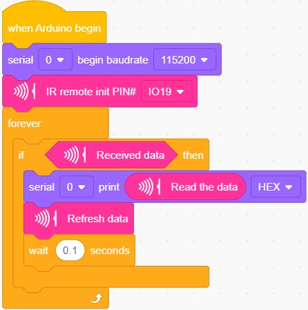

**5.Test Result：**

Upload the test code to the ESP32 board, power up with a USB cable, open
the serial monitor to click  and set to 115200.

Press a key on the IR remote control, you will view a code on the serial
monitor. If FFFFFFFF shows up, just ignore it

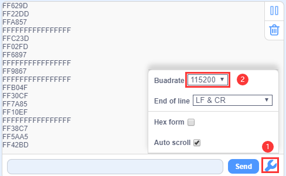

**Code of each key**

### Project 9.2: IR Remote Control Car

**1.Description：**

In the above experiment, we have learned about the knowledge of the 8\*8
dot matrix display, the motor driver and speed regulation, the infrared
receiver and the infrared remote control. In this experiment, we will
use the infrared remote control and the infrared receiver to control the
car.

**2. Working Principle：**

<table>
<tbody>
<tr class="odd">
<td>Keys</td>
<td>Keys Code</td>
<td>Functions</td>
</tr>
<tr class="even">
<td></td>
<td>FF629D</td>
<td>Go forward</td>
</tr>
<tr class="odd">
<td></td>
<td></td>
<td>Display “forward”pattern</td>
</tr>
<tr class="even">
<td></td>
<td>FFA857</td>
<td>Go back</td>
</tr>
<tr class="odd">
<td></td>
<td></td>
<td>Display “back”pattern</td>
</tr>
<tr class="even">
<td></td>
<td>FF22DD</td>
<td>Turn left</td>
</tr>
<tr class="odd">
<td></td>
<td></td>
<td>Show“left” pattern</td>
</tr>
<tr class="even">
<td></td>
<td>FFC23D</td>
<td>Turn right</td>
</tr>
<tr class="odd">
<td></td>
<td></td>
<td>Show“right turning”pattern</td>
</tr>
<tr class="even">
<td></td>
<td>FF02FD</td>
<td>stop</td>
</tr>
<tr class="odd">
<td></td>
<td></td>
<td>show“stop”pattern</td>
</tr>
</tbody>
</table>

3.  **Flow Chart：**

4.  **Test Code：**

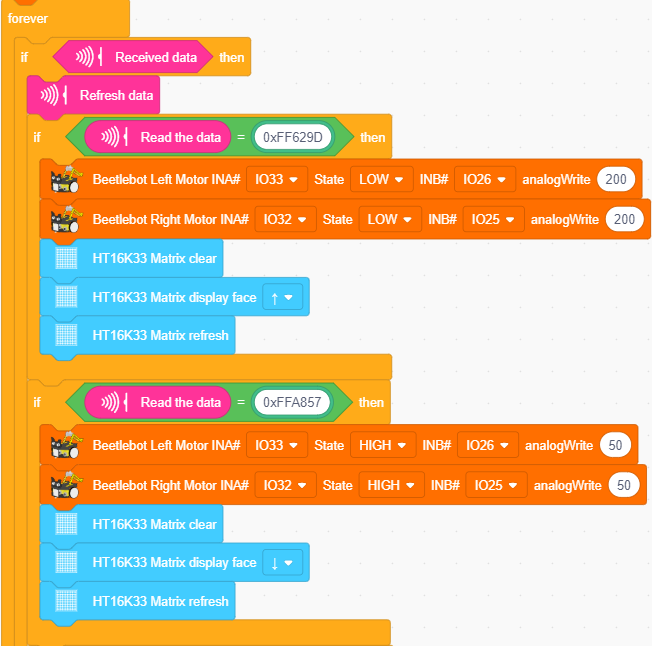

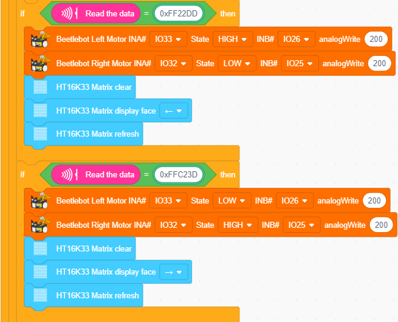

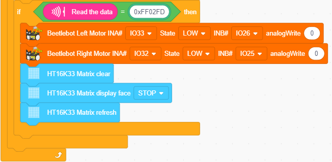

5.  **Test Result：**

Upload the test code to the ESP32 motherboard, install batteries, turn
the power switch to the ON end, power up and press a key of the IR
remote control. Then the car will make the corresponding movement.

## Project 10: WIFI Control

In the previous experiments, we have learned about the three modes of
ESP32: WIFI Station mode, WIFI AP mode and WIFI AP+Station mode. Then in
this chapter, we will use the WIFI Station mode of ESP32 to control a
multi-function car via app

### Project 10.1: Read Character String

**1.Description：**

In this experiment, we first use the WIFI Station mode of ESP32 to read
the characters via app.

**2. Components**

<table>
<tbody>
<tr class="odd">
<td></td>
<td>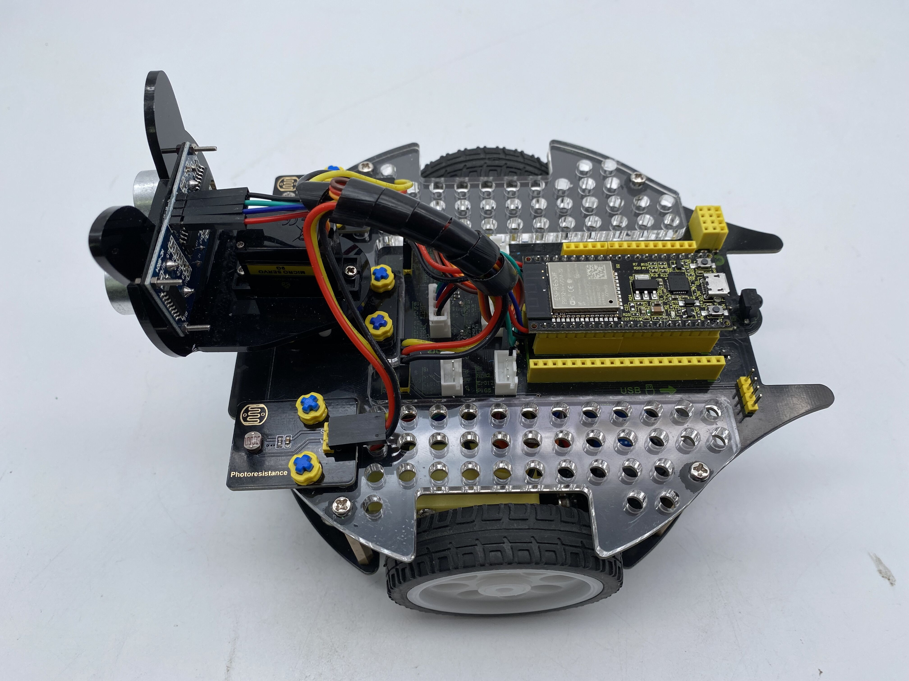</td>
<td></td>
</tr>
<tr class="even">
<td>USB Cablex1</td>
<td>Beetlebot*1</td>
<td>Cellphone/iPad*1</td>
</tr>
</tbody>
</table>

3.  **Install APP**

**Android system：**

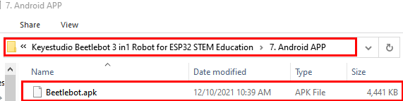

Transfer the file Beetlebot.apk to your cellphone or IPAD, click it to
install, and click“**ALLOW**”→“**INSTALL**”→“**OPEN**”.

**IOS system**

Open App Store

Search Beetlebot，click“”to download Beetlebot.

The installation instructions are similar with Android system.

4.  **Test Code：**

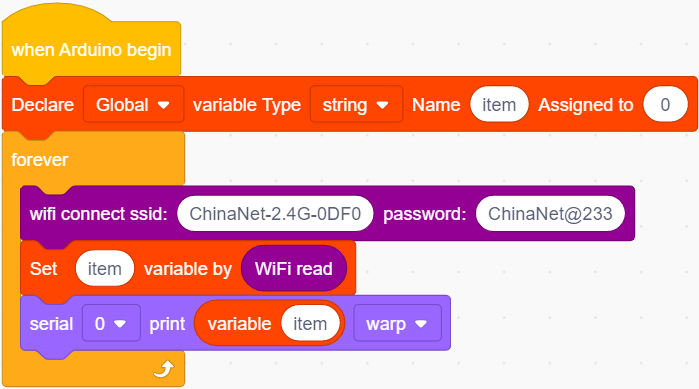

Note:

Change the Wifi name and password into yours

**5. Test Result**

Upload the code to the ESP32 board(if the code can’t be uploaded, you
can click,
as shown below)

Place batteries in the car, turn the power switch to ON end and power
up.

Open the serial monitor and set baud rate to 115200; then the monitor
will print detected WiFi IP address, open app to enter the detected Wifi
IP address in the text box, as shown below;

For example, the following IP address is 192.168.1.137. Then click
button  to connect wifi.

If the IP address 192.168.1.137 is shown in the test box, which means
wifi is connected with app.

Click each key on app, then the monitor will receive corresponding
characters

If the monitor doesn’t display anything, press reset button to reboot

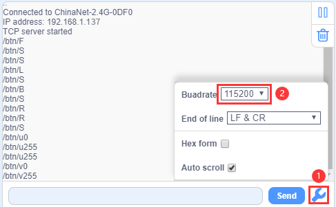

### Project 10.2: Control 8\*8 Dot Matrix Display Via WIFI 

**1.Description：**

In this experiment, we will use the WIFI Station mode to control the
8\*8 dot matrix display on the car through APP and WIFI.

**2. Components**

<table>
<tbody>
<tr class="odd">
<td></td>
<td></td>
<td></td>
</tr>
<tr class="even">
<td>USB Cable x1</td>
<td>Beetlebot*1</td>
<td>Cellphone/iPad*1</td>
</tr>
</tbody>
</table>

2.  **Test Code：**

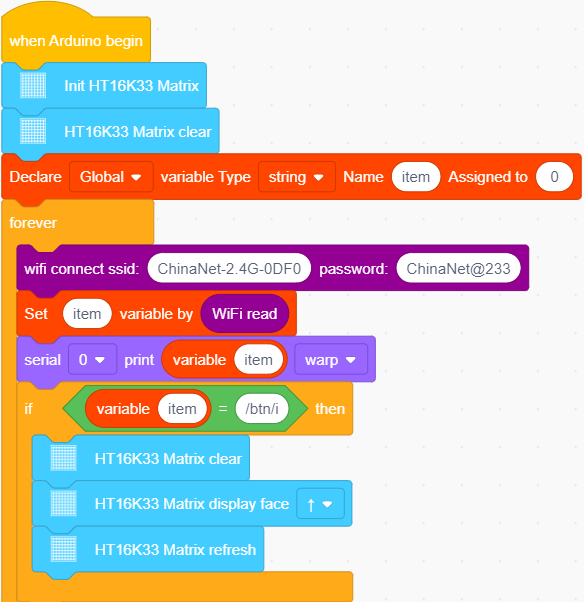

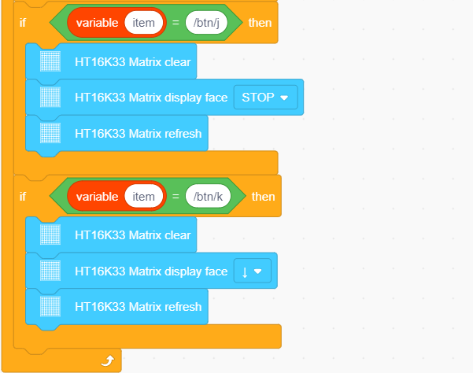

**Test Result**

Open app, click , then the 8\*8 display will
show the forward pattern; click , the display
will show the stop pattern; click  to show the
backward pattern

### **Project 10.3: Control the car via APP**

1.  **Description**
    
    In this project we will demonstrate how to control the car with app

2.  **Components**

<table>
<tbody>
<tr class="odd">
<td></td>
<td></td>
<td></td>
</tr>
<tr class="even">
<td>USB Cable x1</td>
<td>Beetlebot*1</td>
<td>Cellphone/iPad*1</td>
</tr>
</tbody>
</table>

3.  **Test Code**

**Test Result**

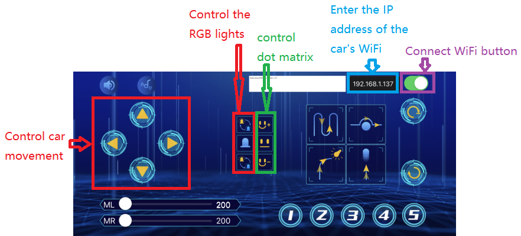

**9. Resources**

Download code,libraries and more details, please refer to the following
link:

[https://fs.keyestudio.com/KS50](https://fs.keyestudio.com/KS0470)02
